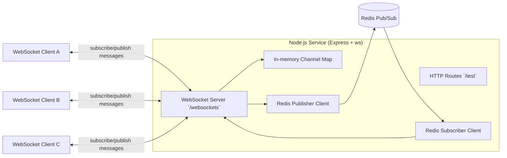

# Redis Pub/Sub with WebSocket

This project is a backend reference implementation for real-time messaging using:
- Node.js + Express for HTTP APIs
- `ws` for WebSocket connections
- Redis Pub/Sub for cross-connection message fan-out

It demonstrates how to connect WebSocket clients to named channels, publish events, and broadcast those events to all subscribers in near real-time.

## What does this project do, and why was it built?

This service lets connected clients:
- subscribe to a channel
- publish a message to a channel
- receive messages that are published to channels they subscribed to

It was built as a practical learning/reference project to show how Redis Pub/Sub and WebSockets fit together in a lightweight real-time architecture. The `websockets/client` notes also document common client-side concerns (reconnect, refresh handling, broken connections, and security awareness).

## What does the architecture look like?

At a high level:

1. A client opens a WebSocket connection on `/websockets` and can include `userid` as a query param.
2. The client sends JSON messages:
   - `{"event":"subscribe","channel":"room-1"}`
   - `{"event":"publish","channel":"room-1","message":"hello"}`
3. The server:
   - subscribes to Redis channels via a Redis subscriber client
   - publishes messages via a Redis publisher client
   - maps active WebSocket connections per channel in-memory
4. When Redis emits a message for a channel, the server forwards it to all connected subscribers for that channel.

### Architecture diagram



### Components

- `server.js`: boots Express, exposes test routes, and attaches WebSocket handling.
- `websockets/index.js`: handles WebSocket lifecycle and Redis Pub/Sub bridge.
- Redis: message broker used for channel-based fan-out.
- Docker support:
  - `Dockerfile` builds the Node service.
  - `docker-compose.yml` runs the service container.

## How do I run this locally?

### Prerequisites

- Node.js 18.x (project tested with 18.16)
- npm 9.x
- Redis server running and reachable on port `6379`

### Environment variables

Create a local env file (for example `dev.env` for Docker, or `.env` for local runs) with:

```env
PORT=9000
NODE_ENV=development
REDIS_HOST=127.0.0.1
```

### Run directly with Node

```sh
npm install
npm run start
```

For development with auto-restart:

```sh
npm run start:dev
```

### Quick local checks

- HTTP health-like check: `GET /test`
- HTTP echo check: `POST /test`
- WebSocket endpoint: `ws://localhost:9000/websockets?userid=123`

## How do I deploy this?

### Docker image

```sh
docker build -t redis-ws-app .
docker run --env-file dev.env -p 9000:9000 redis-ws-app
```

### Docker Compose

```sh
docker compose up --build
```

Notes:
- The compose file expects `dev.env` to exist.
- Ensure `REDIS_HOST` points to a reachable Redis instance from inside the container (for example `host.docker.internal` when Redis runs on the host machine).

## What decisions were made, and why?

- **Express + ws instead of heavier frameworks**: keeps the example minimal and easy to reason about.
- **Separate Redis publisher/subscriber clients**: aligns with Pub/Sub usage patterns and avoids mixed responsibilities.
- **Channel membership tracked in memory**: simple and fast for a single service instance, good for learning and prototypes.
- **Redis as broker**: decouples publish from delivery and enables easier horizontal scaling later.
- **Basic HTTP routes (`/test`) included**: provides quick verification that the service is running independently of WebSocket tests.

## What would be improved next?

- Add connection authentication/authorization for channel-level access control.
- Harden WebSocket reliability with heartbeat/ping-pong cleanup and backpressure handling.
- Add message schema validation and safer JSON parsing with error responses.
- Add automated tests (unit + integration for Redis/WebSocket flows).
- Improve deployment story by including Redis in compose (optional profile) and adding production-ready config examples.
- Add observability (structured logs, metrics, and connection/message tracing).

## References

- [ws npm package](https://www.npmjs.com/package/ws)
- [WebSockets on production with Node.js](https://medium.com/voodoo-engineering/websockets-on-production-with-node-js-bdc82d07bb9f)
- [How to Set Up a WebSocket Server with Node.js and Express](https://cheatcode.co/tutorials/how-to-set-up-a-websocket-server-with-node-js-and-express)
- [Understanding Pub/Sub in Redis](https://raphaeldelio.medium.com/understanding-pub-sub-in-redis-18278440c2a9)
